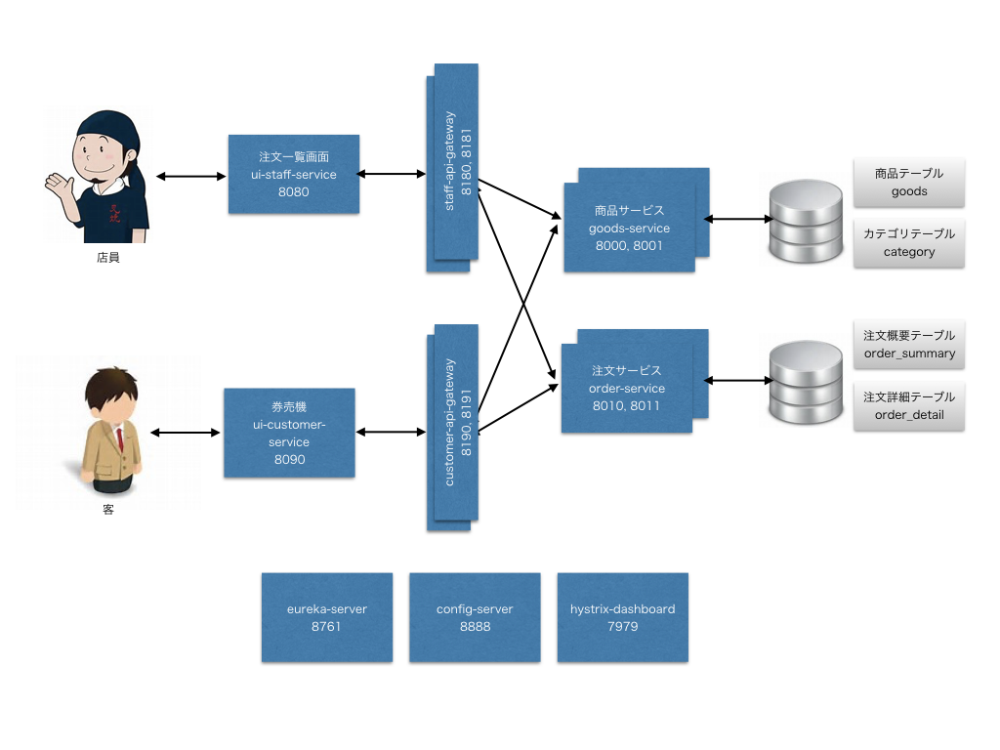

# ramen_oreya

## 全体像

数字はポート番号




## Config Repository

https://github.com/MasatoshiTada/ramen-config.git


## データベース

PostgreSQLを使っています。詳細は下記のプロパティを参照。

https://github.com/MasatoshiTada/ramen-config/blob/master/goods-service-local.properties

https://github.com/MasatoshiTada/ramen-config/blob/master/order-service-local.properties

## ビルド＆実行（ローカル）

```bash
./build-all.sh
java -jar ./config-server/target/config-server-0.0.1-SNAPSHOT.jar
java -jar ./eureka-server/target/eureka-server-0.0.1-SNAPSHOT.jar
SPRING_PROFILES_ACTIVE=local java -jar ./goods-service/target/goods-service-0.0.1-SNAPSHOT.jar
SPRING_PROFILES_ACTIVE=local java -jar ./order-service/target/order-server-0.0.1-SNAPSHOT.jar
SPRING_PROFILES_ACTIVE=local java -jar ./customer-api-gateway/target/customer-api-gateway-0.0.1-SNAPSHOT.jar
SPRING_PROFILES_ACTIVE=local java -jar ./staff-api-gateway/target/staff-api-gateway-0.0.1-SNAPSHOT.jar
SPRING_PROFILES_ACTIVE=local java -jar ./ui-customer-service/target/ui-customer-service-0.0.1-SNAPSHOT.jar
SPRING_PROFILES_ACTIVE=local java -jar ./ui-staff-service/target/ui-staff-service-0.0.1-SNAPSHOT.jar
java -jar ./hystrix-dashboard/target/hystrix-dashboard-0.0.1-SNAPSHOT.jar
```

ブラウザで下記のURLにアクセスしてください。

- お客用UI

http://localhost:8090/

- 店員用UI

http://localhost:8080/


## ビルド＆実行（Pivotal Web Services）

```bash
cf login -a api.run.pivotal.io
cf create-service p-config-server standart config-server -c '{"git": {"cloneOnStart": "true","uri": "https://github.com/MasatoshiTada/ramen-config"}}'
cf create-service p-service-registry service-registry
cf create-service p-circuit-breaker-dashboard circuit-breaker-dashboard

./build-all.sh
cd $PROJECT_ROOT/goods-service
cf push
cd $PROJECT_ROOT/order-service
cf push
cd $PROJECT_ROOT/customer-api-gateway
cf push
cd $PROJECT_ROOT/staff-api-gateway
cf push
cd $PROJECT_ROOT/ui-customer-service
cf push
cd $PROJECT_ROOT/ui-staff-service
cf push
```

ブラウザで下記のURLにアクセスしてください。

- お客用UI

http://ramen-ui-customer-service.cfapps.io/

- 店員用UI

http://ramen-ui-staff-service.cfapps.io/
